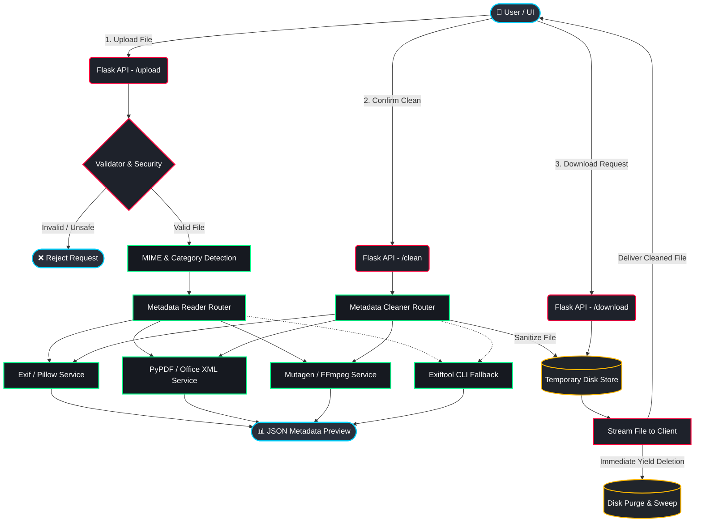

# 🌌 MetaCleaner

<div align="center">
  <p><strong>A Modern, Zero-Trust Metadata Cleaner Web Application.</strong></p>
  <p>Protect your privacy by stripping hidden tracking tags, GPS coordinates, and author signatures from your files before sharing them.</p>
</div>

---

## 📖 Overview

**MetaCleaner** is a production-ready, highly secure web application designed to inspect and scrub metadata from a wide variety of file formats. Built with a robust Flask backend and an immersive 3D glassmorphic frontend, it guarantees absolute privacy by processing files entirely in memory/temporary storage and immediately wiping them from disk upon completion.

## ✨ Key Features

- **🛡️ Zero-Trust Privacy Architecture:** 
  - **In-memory Stream Deletion:** Files are instantly wiped during the download streaming process.
  - **Auto-pruning:** Abandoned uploads are automatically swept and deleted via cron-like periodic tasks.
- **🔍 Comprehensive Metadata Inspection:** Preview exact details (Exif, GPS, software tags, timestamps, etc.) before making any modifications.
- **📂 Multi-Format Support:**
  - **Images:** JPG, JPEG, PNG, TIFF, WebP, HEIC (powered by Pillow & `pi-heif`).
  - **Documents:** PDF (`pypdf`), DOCX, XLSX, PPTX (Direct ZIP/XML stream editing).
  - **Media:** MP3, MP4, MOV, AVI (using `mutagen` with FFmpeg stream copy fallbacks).
- **⚙️ Dual-Layer Processing Engine:** Utilizes pure Python libraries for primary processing, with seamless fallbacks to powerful CLI tools (`exiftool`, `ffmpeg`) when complex manipulation is required.
- **🎨 Futuristic UI/UX:** A responsive, dark-mode-first interface featuring 3D parallax cards, glowing neon accents, and smooth transitions.
- **🔒 Secure API & Rate Limiting:** Built-in UUID file obfuscation and Flask-Limiter integration to prevent path traversal and DDoS attacks.

---

## 🧠 System Architecture & Workflow

The following flowchart illustrates the entire lifecycle of a file processed through MetaCleaner:



---

## 🛠️ Tech Stack

- **Backend:** Python 3.9+, Flask, Flask-Limiter, Flask-Talisman, Gunicorn, Werkzeug
- **Frontend:** Vanilla HTML5, CSS3 (Glassmorphism & Neon UI), JavaScript (ES6+ AJAX)
- **Data Processors:** `pillow`, `pi-heif`, `pypdf`, `mutagen`
- **CLI Fallbacks:** `exiftool`, `ffmpeg`

---

## 🗂️ Project Structure

```text
metacleaner/
├── app.py                     # Main Flask Application
├── config.py                  # App & Environment configurations
├── requirements.txt           # Python dependencies
├── core/                      # Core business logic
│   ├── cleaner.py             # Router for cleaning operations
│   ├── detector.py            # MIME-type identification
│   ├── metadata_reader.py     # Router for reading metadata
│   ├── response.py            # JSON standardizations
│   ├── utils.py               # Helpers & cron sweeping logic
│   └── validator.py           # File security & size checks
├── cleaners/                  # Cleaners per file-type category
│   ├── image/                 # JPG, PNG, TIFF, WEBP, HEIC
│   ├── documents/             # PDF, DOCX, XLSX, PPTX
│   └── media/                 # MP3, MP4, Audio/Video
├── services/                  # Abstraction layer for external libs/CLIs
│   ├── exif_service.py        # Pillow-based EXIF stripper
│   ├── exiftool_service.py    # Exiftool CLI wrapper
│   ├── ffmpeg_service.py      # FFmpeg CLI wrapper
│   ├── mutagen_service.py     # Audio/Video Tag editor
│   ├── office_service.py      # Open XML (ZIP) metadata editor
│   └── pdf_service.py         # PyPDF metadata editor
├── static/                    # Frontend assets
│   ├── css/style.css          # Core visual styling
│   └── js/script.js           # Client-side operations
└── templates/                 # Jinja2 HTML templates
    ├── base.html              # Main layout & UI components
    ├── index.html             # Application dashboard
    ├── privacy.html           # Privacy policy
    ├── about.html             # About page
    └── 404.html               # Error handling
```

---

## 🚀 Setup & Installation

### 1. Prerequisites
Ensure you have the following installed on your system:
- **Python 3.9** or higher.
- *(Optional but Recommended)* **[ExifTool](https://exiftool.org/)**: For comprehensive fallback support on edge-case files.
- *(Optional but Recommended)* **[FFmpeg](https://ffmpeg.org/)**: For robust media stream cleaning.

### 2. Installation
Clone the repository and install the Python dependencies:

```bash
git clone https://github.com/yourusername/metacleaner.git
cd metacleaner
pip install -r requirements.txt
```

### 3. Running the Application
Start the Flask development server:

```bash
python app.py
```
*The application will be available locally at `http://127.0.0.1:5000`.*

### 4. Production Deployment
For production environments, it is highly recommended to run MetaCleaner via Gunicorn or behind a reverse proxy (e.g., Nginx, Render, Heroku):
```bash
gunicorn -w 4 -b 0.0.0.0:5000 app:app
```
*(MetaCleaner is pre-configured with `ProxyFix` for immediate reverse-proxy compatibility).*

---

## 🔒 Security Practices & Privacy Policy

Privacy isn't an afterthought—it's the core of MetaCleaner.
- **No Persistent Storage:** Uploaded and processed files are saved temporarily to a localized `temp/` folder using obfuscated UUID filenames.
- **Immediate Shredding:** Utilizing Flask's generator `yield` patterns, files are deleted off the disk the moment the network download stream completes.
- **Path Traversal Protection:** Filenames are strictly sanitized via Werkzeug's `secure_filename`. Directory boundaries are tightly validated.
- **Self-Healing Sweeper:** A periodic cleanup function guarantees that dropped sessions or un-downloaded files are hard-deleted every 15 minutes.
- **DDoS Mitigation:** `Flask-Limiter` regulates excessive API hits on crucial endpoints (`/upload`, `/clean`).

---

## 📄 License
This project is provided as-is. Use responsibly and ensure you have the right to modify the files you process.
